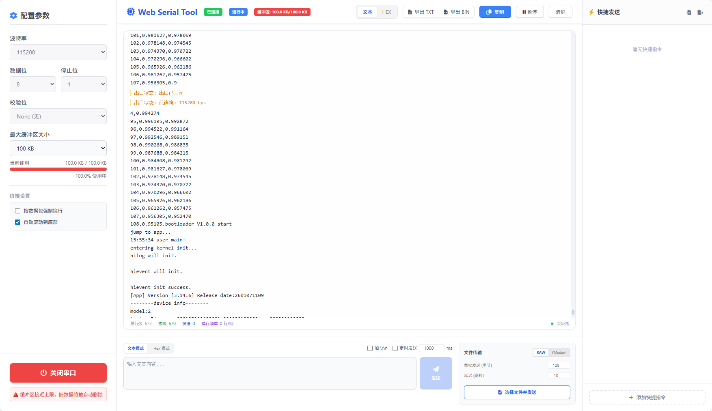

# 极简网页串口助手

一款基于Web的轻量级串口调试工具，无需安装任何软件，直接在浏览器中即可使用，帮助开发者更高效地进行串口通信调试。



## 功能特色

- **串口连接与配置**：支持标准串口参数设置（波特率、数据位、停止位等）
- **实时数据收发**：清晰展示串口收发数据，支持十六进制和字符串格式切换
- **自定义快捷发送区**：可保存常用命令，一键发送，提高调试效率
- **数据导出功能**：支持将接收的数据导出为文本文件
- **文件传输**：支持从本地文件读取数据并发送到串口

## 安装与使用

### 本地开发

1. 克隆项目到本地目录
2. 安装依赖：
   ```bash
   npm install
   ```
3. 启动本地开发服务器：
   ```bash
   npm run dev
   ```

### 生产构建

1. 构建生产版本：
   ```bash
   npm run build
   ```
2. 部署 [dist](dist/) 目录内容到静态服务器或直接打开index.html

## 注意事项

- 由于使用了Web Serial API，该工具仅在支持此API的浏览器中工作（主要是Chrome/Edge 89+）
- 首次使用需要授权浏览器访问串口设备
- 为保证稳定性，建议在本地网络环境下使用
