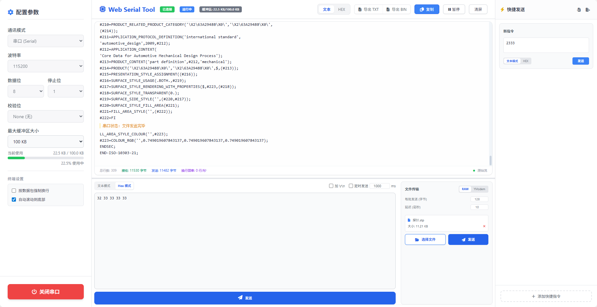

# 极简网页串口助手

一款基于Web的轻量级串口调试工具，无需安装任何软件，直接在浏览器中即可使用，帮助开发者更高效地进行串口通信调试。支持串口和WebSocket双模式通信。



## 功能特色

### 通信模式
- **串口通信**：基于Web Serial API，支持标准串口参数设置
  - 波特率：支持常见波特率（9600、19200、38400、57600、115200等）
  - 数据位：5、6、7、8
  - 停止位：1、2
  - 校验位：None、Even、Odd
  - 流控：None
- **WebSocket通信**：支持WebSocket连接，实现网络串口功能
  - 自动重连：连接断开后自动尝试重连（可手动放弃）
  - 智能发送：Text模式发送文本字符串，Hex模式发送字节数据

### 数据显示与操作
- **实时数据收发**：清晰展示串口收发数据
  - TX/RX数据分色显示（TX蓝色，RX灰色）
  - 时间戳精确到毫秒
- **显示格式切换**：
  - Text模式：显示可读文本
  - Hex模式：显示十六进制格式（字节间以空格分隔）
  - 模式切换时自动转换已有数据格式
- **显示模式**：
  - 自动换行模式：每条数据独立显示，带时间戳和类型标签
  - 原始流模式：数据连续显示，适合大量数据传输
- **自动滚动**：新数据到达时自动滚动到底部
- **暂停/恢复**：随时暂停数据接收，方便查看历史数据

### 数据管理
- **缓冲区管理**：
  - 可自定义最大缓冲区大小（默认100KB）
  - 实时显示当前缓冲区使用情况
  - 超过限制时自动清理旧数据
- **数据导出**：
  - 导出为TXT文本文件
  - 导出为BIN二进制文件
  - 一键复制所有RX/TX数据到剪贴板
- **清屏功能**：快速清除所有显示内容

### 发送功能
- **文本/Hex模式发送**：
  - 文本模式：直接发送字符串
  - Hex模式：输入十六进制数据（如 `41 42 43`）发送对应字节
  - 模式切换时自动转换输入内容
  - 添加\r\n选项：自动在发送内容后添加回车换行符
- **定时发送**：
  - 设置定时发送间隔（毫秒）
  - 自动定时发送输入框中的内容
- **文件传输**：
  - RAW模式：直接发送文件原始数据
  - YModem模式：支持YModem协议传输
  - 可自定义每批发送字节数和延迟时间
  - 实时显示发送进度
- **快捷发送列表**：
  - 保存常用命令，一键发送
  - 支持添加、编辑、删除快捷命令
  - 可自定义命令名称和内容

### 用户体验优化
- **设置持久化**：
  - WebSocket服务器地址自动保存
  - 发送区域内容自动保存
  - 快捷发送列表自动保存
  - 缓冲区大小设置自动保存
- **状态提示**：
  - 连接状态指示（已连接/未连接）
  - 运行状态指示（运行中/已暂停）
  - 缓冲区使用率提示（正常/接近上限）
  - 换行频率统计（行/秒）
- **响应式布局**：可拖拽调整接收区和发送区的大小比例

## 安装与使用

### 本地开发

1. 克隆项目到本地目录
2. 安装依赖：
   ```bash
   npm install
   ```
3. 启动本地开发服务器：
   ```bash
   npm run dev
   ```

### 生产构建

1. 构建生产版本：
   ```bash
   npm run build
   ```
2. 部署 [dist](dist/) 目录内容到静态服务器或直接打开index.html

## 注意事项

- 由于使用了Web Serial API，串口功能仅在支持此API的浏览器中工作（主要是Chrome/Edge 89+）
- 首次使用串口功能需要授权浏览器访问串口设备
- WebSocket功能在所有现代浏览器中都可用
- 为保证稳定性，建议在本地网络环境下使用
