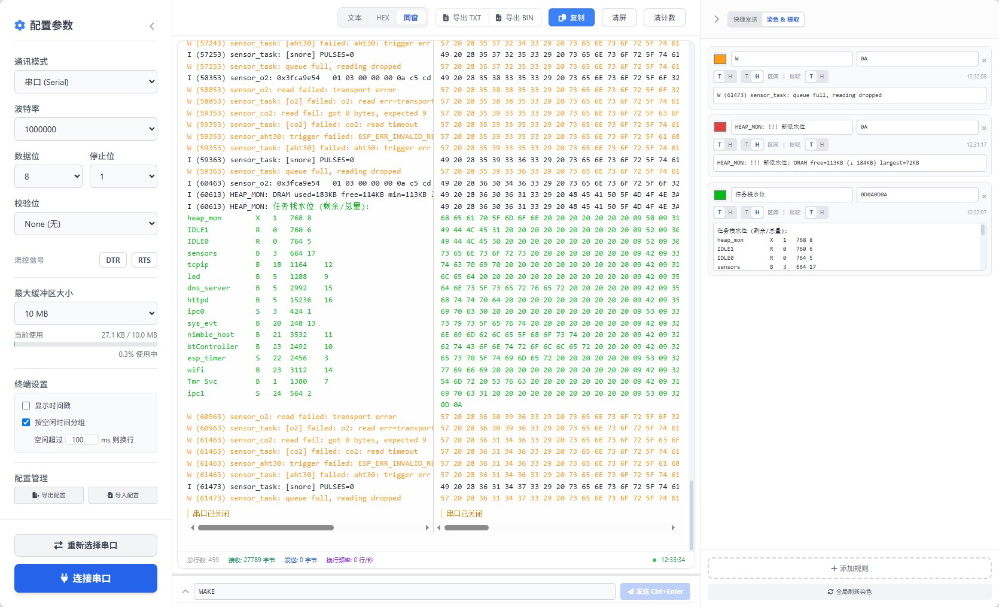

**English** | [中文](./README.zh-CN.md)

# Online Serial / Bluetooth / WebSocket Debug Tool

A browser-based, install-free, minimal communication debug platform. Serial, Bluetooth, and WebSocket in one tool — real-time send/receive + keyword highlighting + data extraction.

GitHub: https://github.com/createskyblue/web-serial-monitor
Online: https://createskyblue.github.io/web-serial-monitor/



| Quick Send | Highlight & Extract |
| --- | --- |
|  |  |

## 🚀 Killer Features

### Three Communication Modes
- **Serial** — Web Serial API, no driver needed, works right in Chrome/Edge
- **WebSocket** — network passthrough / remote serial (needs local deployment, see Notes)
- **Bluetooth BLE** — Web Bluetooth API, UUID16 / full UUID, TX/RX characteristics

### Keyword Highlight + Extract — one rule does both
- Fill "start + end" → **Range mode**: highlight the range + extract its content
- Fill only "start" → **Keyword mode**: highlight the keyword + extract its occurrence time
- Text / HEX dual-mode matching; extracted results **auto-latch**, never lost by incoming data

### Pro Debugging Details
- **Display**: Text / HEX / Split (Text|HEX side-by-side), `Tab` to switch
- **Tri-fold layout**: collapse left/right sidebars & send area — the whole app can shrink to a tiny window that barely takes any space
- **Flow control**: DTR / RTS manual control, pre-settable before connecting
- **Smart auto-scroll**: follows only when you're at the bottom — scrolling up won't yank you
- **Send**: timed send, file send (RAW / YModem), quick-send list
- **Manage**: buffer protection, export TXT/BIN, one-click copy, config import/export, clear

### ⌨️ Shortcuts
- `Tab` — switch display mode (Text / HEX / Split)
- `p` — connect / disconnect
- `c` — clear screen
- `Ctrl+Enter` / `Cmd+Enter` — send
- `[` / `]` — collapse/expand sidebars
- `'` — collapse/expand send area

## 🛠 Quick Start

```bash
npm install
npm run dev      # local development
npm run build    # production build, deploy the dist/ directory
```

## ⚠️ Notes

- Serial / Bluetooth require **HTTPS or localhost** (browser security)
- **WebSocket mode needs local deployment**: HTTPS pages can only connect to secure wss://. To connect to a plain ws:// local/LAN service, run this tool on **localhost** (`npm run dev`, or serve `dist/` after `npm run build`)
- Recommended browsers: **Chrome / Edge**
